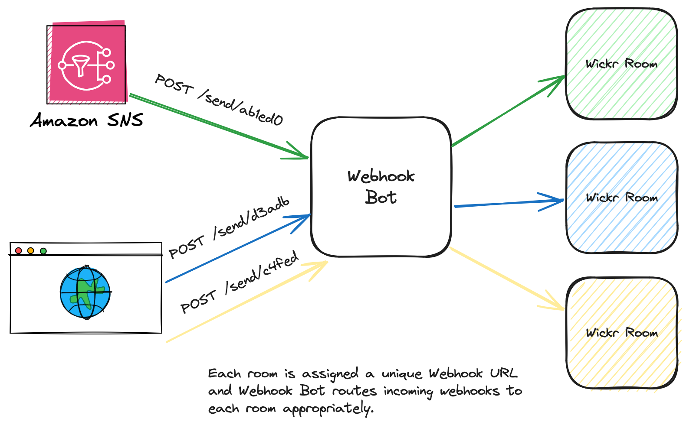

# Wickr Webhook Bot



This project is a WickrIO integration created via [cookiecutter-wickr-bot](https://github.com/WickrInc/cookiecutter-wickr-bot)

## Installation

See the WickrIO [Getting Started Guide](https://wickrinc.github.io/wickrio-docs/#wickr-io-getting-started).

## Usage

Webhook Bot understands the following commands:

 - `/help` - Prints a help message with all available commands
 - `/show` - Show the webhook URL for the current room
 - `/rekey` - Rotate the current webhook URL for the room

### Sending a webhook message

The API is almost identical to the [Slack Incoming Webhooks API](https://api.slack.com/messaging/webhooks#posting_with_webhooks).

``` bash
curl https://hooks.example.com/send/$KEY -d 'payload={"text": "hello world"}'
# or
curl https://hooks.example.com/send/$KEY -H "Content-type: application/json" -d '{"text": "hello world"}'
```

It also accepts webhooks in the [AWS Chime](https://github.com/awsdocs/amazon-chime-developer-guide/blob/master/doc_source/webhooks.md) format:

``` bash
curl https://hooks.example.com/send/$KEY -H "Content-type: application/json" -d '{"Content": "hello world"}'
```

#### Simple Notification Service (SNS)

The Webhook Bot also supports use as an HTTPS subscription endpoint for Amazon SNS. It will automatically confirm subscription to the topic, and send the message body of the SNS Notification into the Wickr room. 

When configuring the subscription to your SNS topic, select the `HTTPS` protocol, enter in the HTTPS URL of the webhook receiver for your particular room, and ensure that raw message delivery is _not_ enabled on the subscription.

## Configuration

When installing this bot, there are two configuration values which will need to be set.

The first is the HTTP port for the server to listen on, which defaults to `8080``. You generally won't need to change this value unless it conflicts with another listener in your bot container. When deploying the bot container, it is important that you expose this port so that it is accessible outside of the container.

The second configuration is for the frontend URL for the webhook receiver. This is the URL which points to your webhook bot, and where you will send all webhooks in order to reach your Wickr rooms. This URL is used as the base URL for forming complete webhook URLs within each room. For example, if you set the frontend URL to `https://hooks.example.com/` the bot will generate webhook URLs for rooms which look like `https://hooks.example.com/send/BP6CwLpODqcDYtThoUyY0JWqMyYvTcLK`.

## Development

### Building

Run `make` to create a new `software.tar.gz` package, which can be installed as a WickrIO Custom Integration. See the [WickrIO docs](https://wickrinc.github.io/wickrio-docs/#developing-integrations-creating-an-integration-locally) for more details.

# License

This software is distributed under the [Apache License, version 2.0](https://www.apache.org/licenses/LICENSE-2.0.html)

```
   Copyright 2021 Wickr, Inc.

   Licensed under the Apache License, Version 2.0 (the "License");
   you may not use this file except in compliance with the License.
   You may obtain a copy of the License at

       http://www.apache.org/licenses/LICENSE-2.0

   Unless required by applicable law or agreed to in writing, software
   distributed under the License is distributed on an "AS IS" BASIS,
   WITHOUT WARRANTIES OR CONDITIONS OF ANY KIND, either express or implied.
   See the License for the specific language governing permissions and
   limitations under the License.
```
